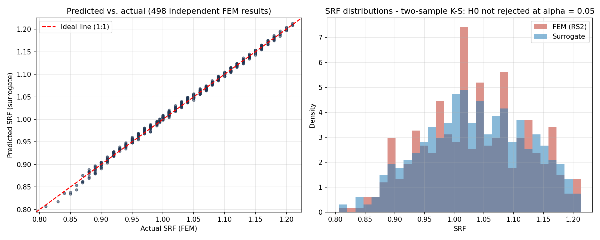
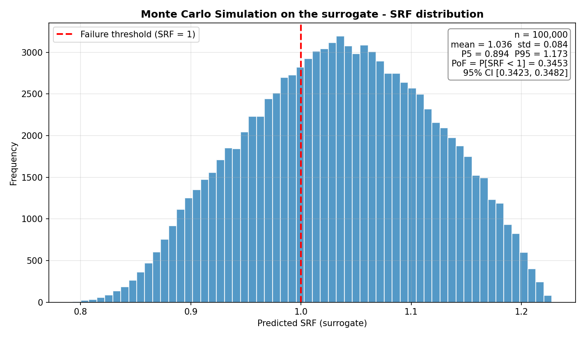

# geosurrogate

**Reliability analysis for slope stability — powered by active-learning Gaussian Process surrogates.**

geosurrogate replaces an expensive geotechnical finite-element model with a fast,
statistically validated surrogate, then runs massive Monte Carlo on it to estimate
the **probability of failure (PoF)** of a slope — at a fraction of the FEM cost.


> **Status — working prototype.** Core, dashboard, validation/exploitation and the
> real RS2 adapter are complete and verified (49 tests, including an end-to-end run
> against real `deepgp`). Design deep-dive in [ARQUITECTURA.md](ARQUITECTURA.md).

---

## The problem

A finite-element slope model (RS2) takes minutes per run. A Monte Carlo reliability
analysis needs *thousands* of runs — that is days of compute for a single design.
The standard shortcut is to fit a cheap surrogate, but a surrogate is only trustworthy
if (a) it was trained on the *right* points and (b) its accuracy is proven against
data it never saw.

## The approach

geosurrogate builds the surrogate with **active learning** — it decides which FEM
runs are worth spending — and holds itself to a rigorous validation standard before
any probability is reported.

```
  DoE                Active Learning loop                 Validation                 Exploitation
 (space-      ┌──────────────────────────────┐      ┌──────────────────┐      ┌──────────────────┐
  filling) ──▶│ fit GP → score ALC → run FEM │──▶   │ LOOCV (internal) │──▶   │ Monte Carlo on   │
             │  → append → stable surface?   │      │ massive vs held- │      │ the surrogate →  │
             └──────────────────────────────┘      │  out FEM · K-S   │      │ PoF + confidence │
              stops when the predicted surface     └──────────────────┘      └──────────────────┘
              stops changing (TFM criterion)
```

- **Gaussian Process surrogate** via R's [`deepgp`](https://cran.r-project.org/package=deepgp)
  (MCMC inference); Python owns the scaling so the R worker is dimensionality-agnostic.
- **ALC acquisition** (Active Learning Cohn) selects the next FEM run to maximise
  information gain; candidate scoring is parallelised across CPU cores.
- **Solver-agnostic core** behind a `FEMSolver` interface — **RS2** today; PLAXIS/FLAC
  are drop-in future adapters. The core never imports the UI.
- **Demo mode needs no RS2 license**: every SRF served is a *real* precomputed RS2
  finite-element result from a pool — no interpolated ground truth.

## It works — verified against real FEM

Two of the three packaged cases, with numbers taken straight from their metrics files:

| Case | Dim | FEM runs (DoE + AL) | LOOCV R² | Massive R² *(vs held-out FEM)* | Two-sample K-S | Probability of failure |
|---|---|---|---|---|---|---|
| **`slope_2d`** — homogeneous slope | 2D | **18** (9 + 9) | 0.993 | **0.998** vs 498 runs | D = 0.040, p = 0.82 · H₀ not rejected | P[SRF < 1] = **0.345** [0.342, 0.348] |
| **`embankment_3d`** — self-generated¹ | 3D | **29** (27 + 2) | 0.984 | **0.988** vs 80 runs | D = 0.075, p = 0.98 · H₀ not rejected | P[SRF < 1.3] = **0**, < 3·10⁻⁵ (95%)² |

<sub>¹ Dogfooding: this case was produced *by* geosurrogate driving RS2 end to end.
² Rule of three (0 failures in 100k samples); the normal approximation is not used at p = 0.
`slope_2d` reproduces the author's MSc-thesis reference result (R² ≈ 0.997).</sub>

**Surrogate vs. FEM on 498 independent runs** — the surrogate lands on the 1:1 line,
and the surrogate/FEM SRF distributions are statistically indistinguishable (K-S,
α = 0.05):



**100 000-sample Monte Carlo on the surrogate** — the probability of failure with a
95% confidence interval, computed in seconds because every draw is a surrogate
evaluation, not a FEM run:



## Quickstart — demo mode (no RS2 license required)

```bash
python -m venv .venv
.venv\Scripts\activate            # Windows;  source .venv/bin/activate on Linux/macOS
pip install -e ".[ui]"
geosurrogate demo list
geosurrogate ui                   # dashboard at http://localhost:8501
```

Training/validation/exploitation retrain the GP with R at each step, so they need a
local R install (tested with **R 4.5.3 + deepgp 1.2.1**):

```r
install.packages("deepgp")
```

Prefer the terminal? The whole pipeline is scriptable:

```bash
geosurrogate demo run slope_2d      # DoE → active learning → auto-LOOCV
geosurrogate validate <project> --loocv --massive --ks
geosurrogate exploit  <project>     # Monte Carlo → PoF
geosurrogate report   <project>     # self-contained HTML report
```

## Full workflow — with a real RS2 model

On a Windows machine with a licensed RS2, add the matching scripting package and
point a project at a `.fez` model:

```bash
pip install -e ".[ui,rs2]"          # installs the RS2Scripting build for your RS2 generation
```

The dashboard walks it from scratch: upload a `.fez` → discover materials → pick the
random variables and their distributions → the recommended DoE is chosen by
dimensionality → train, validate, exploit, and export an HTML report.

## Repository layout

- `src/geosurrogate/` — core package (never imports Streamlit): `config`, `project`,
  `solvers/` (RS2 + demo), `doe/`, `surrogate/` (R bridge), `activelearning/`,
  `validation/`, `exploitation/`, `reporting/`
- `app/` — Streamlit dashboard (8 guided pages, EN/ES)
- `demo_cases/` — packaged demo datasets (derived data only; **no `.fez` files**)
- `tools/` — one-off maintenance scripts (demo-case packaging)
- `tests/` — unit tests + an end-to-end demo test that trains real `deepgp`

## Documentation

- [ARQUITECTURA.md](ARQUITECTURA.md) — full architecture and design decisions

## Roadmap

- CI (GitHub Actions: Ubuntu + R + deepgp; the demo solver runs the full e2e without RS2)
- Auto-generated report on validation completion · sensitivity (tornado) in exploitation
- Additional solver adapters (PLAXIS, FLAC) behind the existing `FEMSolver` interface

## Author

**Geovanny Benavides** — MSc in Geological Engineering, Universidad Politécnica de
Madrid. geosurrogate grew out of the reliability-analysis methodology in his MSc
thesis (RS2 ↔ deepgp).

## License

Released under the [MIT License](LICENSE) — © 2026 Geovanny Benavides.
